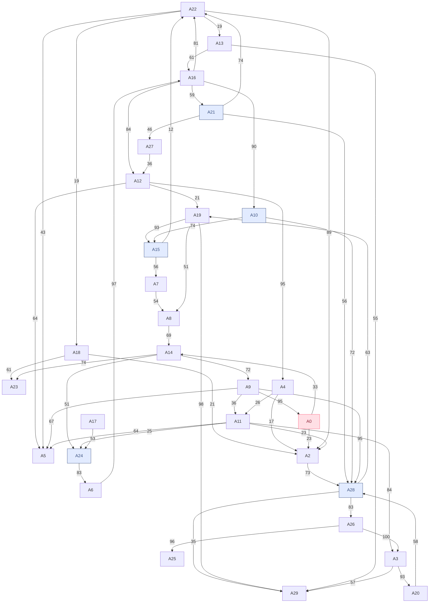

# The Coder Cafe 1000 Subscriber Challenge Solution

This is my attempt at a solution to the challenge presented in [The Coder Cafe](https://www.thecoder.cafe/p/1000).

You can view the Mermaid flowchart [below](#mermaid-flowchart).

The maximum number of passengers is 66 (33 to `A24` and 33 to `A28`). It is impossible to reach any of the other destination nodes without first going through another destination.

## Paths

- `A0 -33-> A14 -51-> A24 (33)`
- `A0 -33-> A14 -72-> A9 -36-> A11 -25-> A24 (25)`
- `A0 -23-> A2 -73-> A28 (23)`
- `A0 -33-> A14 -72-> A9 -95-> A28 (33)`
- `A0 -33-> A14 -72-> A9 -36-> A11 -23-> A2 -73-> A28 (23)`
- `A0 -33-> A14 -72-> A9 -36-> A11 -84-> A3 -93-> A20 -58-> A28 (33)`

## Origin

- `A0 -> A14 -> A24 (33)`
- `A0 -> A14 -> A9 -> A28 (33)`
- `A0 -> A14 -> A9 -> A11 -> A3 -> A20 -> A28 (33)`

## Loop

These are the paths that got looped around to a node that was already traversed. While it's possible that they wouldn't have been stuck in the loop, there was no point in traversing them further. The node inside (parentheses) is the node that was already traversed, causing the loop. Nodes with asterisks `*` around them are destination nodes, indicating that the path loops back around to the destination.

### A10

- `(A16) -> A22 -> A13 -> A16 -> A10`

### A15

- `(*A15*) -> A22 -> A13 -> A16 -> A12 -> A19 -> A15`
- `(A16) -> A22 -> A13 -> A16 -> A12 -> A19 -> A15`

### A21

- `(A16) -> A22 -> A13 -> A16 -> A21`
- `(*A21*) -> A22 -> A13 -> A16 -> A21`

### A24

- `(A16) -> A22 -> A13 -> A16 -> A12 -> A4 -> A11 -> A24`
- `(A16) -> A22 -> A13 -> A16 -> A12 -> A19 -> A8 -> A14 -> A24`
- `(A16) -> A22 -> A13 -> A16 -> A12 -> A19 -> A8 -> A14 -> A9 -> A11 -> A24`
- `(*A24*) -> A6 -> A16 -> A12 -> A4 -> A11 -> A24`
- `(*A24*) -> A6 -> A16 -> A12 -> A19 -> A8 -> A14 -> A24`
- `(*A24*) -> A6 -> A16 -> A12 -> A19 -> A8 -> A14 -> A9 -> A11 -> A24`

### A28

- `(A16) -> A22 -> A13 -> A16 -> A12 -> A4 -> A2 -> A28`
- `(A16) -> A22 -> A13 -> A16 -> A12 -> A4 -> A11 -> A2 -> A28`
- `(A16) -> A22 -> A13 -> A16 -> A12 -> A4 -> A11 -> A3 -> A20 -> A28`
- `(A16) -> A22 -> A13 -> A16 -> A12 -> A19 -> A8 -> A14 -> A9 -> A28`
- `(A16) -> A22 -> A13 -> A16 -> A12 -> A19 -> A8 -> A14 -> A9 -> A11 -> A2 -> A28`
- `(A16) -> A22 -> A13 -> A16 -> A12 -> A19 -> A8 -> A14 -> A9 -> A11 -> A3 -> A20 -> A28`
- `(A22) -> A13 -> A16 -> A22 -> A2 -> A28`
- `(A22) -> A13 -> A16 -> A22 -> A18 -> A2 -> A28`
- `(*A28*) -> A26 -> A3 -> A20 -> A28`
- `(*A28*) -> A19 -> A8 -> A14 -> A9 -> A28`
- `(*A28*) -> A19 -> A8 -> A14 -> A9 -> A11 -> A2 -> A28`
- `(*A28*) -> A19 -> A8 -> A14 -> A9 -> A11 -> A3 -> A20 -> A28`

## Invalid

These are the paths that don't go to the origin `A0`.

- `A17 -> A24`

## Other destinations

These are the paths that go through other destinations. Since the travel stops once a destination is reached, these paths cannot happen. The node in asterisks `*` is the other destination node.

### A10

- `*A15* -> A22 -> A13 -> A16 -> A10`
- `*A21* -> A22 -> A13 -> A16 -> A10`
- `*A24* -> A6 -> A16 -> A10`

### A15

- `*A10* -> A15`
- `*A21* -> A27 -> A12 -> A19 -> A15`
- `*A21* -> A22 -> A13 -> A16 -> A12 -> A19 -> A15`
- `*A24* -> A6 -> A16 -> A12 -> A19 -> A15`
- `*A28* -> A19 -> A15`

### A21

- `*A15* -> A22 -> A13 -> A16 -> A21`
- `*A24* -> A6 -> A16 -> A21`

### A24

- `*A15* -> A7 -> A8 -> A14 -> A24`
- `*A15* -> A7 -> A8 -> A14 -> A9 -> A11 -> A24`
- `*A15* -> A22 -> A13 -> A16 -> A12 -> A19 -> A8 -> A14 -> A24`
- `*A15* -> A22 -> A13 -> A16 -> A12 -> A19 -> A8 -> A14 -> A9 -> A11 -> A24`
- `*A15* -> A22 -> A13 -> A16 -> A12 -> A4 -> A11 -> A24`
- `*A21* -> A27 -> A12 -> A4 -> A11 -> A24`
- `*A21* -> A27 -> A12 -> A19 -> A8 -> A14 -> A24`
- `*A21* -> A22 -> A13 -> A16 -> A12 -> A4 -> A11 -> A24`
- `*A21* -> A22 -> A13 -> A16 -> A12 -> A19 -> A8 -> A14 -> A24`
- `*A21* -> A22 -> A13 -> A16 -> A12 -> A19 -> A8 -> A14 -> A9 -> A11 -> A24`
- `*A21* -> A27 -> A12 -> A19 -> A8 -> A14 -> A9 -> A11 -> A24`
- `*A28* -> A19 -> A8 -> A14 -> A24`
- `*A28* -> A19 -> A8 -> A14 -> A9 -> A11 -> A24`

### A28

- `*A10* -> A28`
- `*A15* -> A22 -> A2 -> A28`
- `*A15* -> A22 -> A18 -> A2 -> A28`
- `*A15* -> A7 -> A8 -> A14 -> A9 -> A28`
- `*A15* -> A7 -> A8 -> A14 -> A9 -> A11 -> A2 -> A28`
- `*A15* -> A22 -> A13 -> A16 -> A12 -> A4 -> A2 -> A28`
- `*A15* -> A7 -> A8 -> A14 -> A9 -> A11 -> A3 -> A20 -> A28`
- `*A15* -> A22 -> A13 -> A16 -> A12 -> A4 -> A11 -> A2 -> A28`
- `*A15* -> A22 -> A13 -> A16 -> A12 -> A4 -> A11 -> A3 -> A20 -> A28`
- `*A15* -> A22 -> A13 -> A16 -> A12 -> A19 -> A8 -> A14 -> A9 -> A28`
- `*A15* -> A22 -> A13 -> A16 -> A12 -> A19 -> A8 -> A14 -> A9 -> A11 -> A2 -> A28`
- `*A15* -> A22 -> A13 -> A16 -> A12 -> A19 -> A8 -> A14 -> A9 -> A11 -> A3 -> A20 -> A28`
- `*A21* -> A28`
- `*A21* -> A22 -> A2 -> A28`
- `*A21* -> A22 -> A18 -> A2 -> A28`
- `*A21* -> A27 -> A12 -> A4 -> A2 -> A28`
- `*A21* -> A27 -> A12 -> A4 -> A11 -> A2 -> A28`
- `*A21* -> A27 -> A12 -> A4 -> A11 -> A3 -> A20 -> A28`
- `*A21* -> A27 -> A12 -> A19 -> A8 -> A14 -> A9 -> A28`
- `*A21* -> A22 -> A13 -> A16 -> A12 -> A4 -> A2 -> A28`
- `*A21* -> A22 -> A13 -> A16 -> A12 -> A4 -> A11 -> A2 -> A28`
- `*A21* -> A27 -> A12 -> A19 -> A8 -> A14 -> A9 -> A11 -> A2 -> A28`
- `*A21* -> A22 -> A13 -> A16 -> A12 -> A4 -> A11 -> A3 -> A20 -> A28`
- `*A21* -> A22 -> A13 -> A16 -> A12 -> A19 -> A8 -> A14 -> A9 -> A28`
- `*A21* -> A27 -> A12 -> A19 -> A8 -> A14 -> A9 -> A11 -> A3 -> A20 -> A28`
- `*A21* -> A22 -> A13 -> A16 -> A12 -> A19 -> A8 -> A14 -> A9 -> A11 -> A2 -> A28`
- `*A21* -> A22 -> A13 -> A16 -> A12 -> A19 -> A8 -> A14 -> A9 -> A11 -> A3 -> A20 -> A28`
- `*A24* -> A6 -> A16 -> A22 -> A2 -> A28`
- `*A24* -> A6 -> A16 -> A12 -> A4 -> A2 -> A28`
- `*A24* -> A6 -> A16 -> A22 -> A18 -> A2 -> A28`
- `*A24* -> A6 -> A16 -> A12 -> A4 -> A11 -> A2 -> A28`
- `*A24* -> A6 -> A16 -> A12 -> A4 -> A11 -> A3 -> A20 -> A28`
- `*A24* -> A6 -> A16 -> A12 -> A19 -> A8 -> A14 -> A9 -> A28`
- `*A24* -> A6 -> A16 -> A12 -> A19 -> A8 -> A14 -> A9 -> A11 -> A2 -> A28`
- `*A24* -> A6 -> A16 -> A12 -> A19 -> A8 -> A14 -> A9 -> A11 -> A3 -> A20 -> A28`

## Connections

This is the set of all incoming and outgoing connections from each node. The node in underscores `_` is the origin node, and the nodes in asterisks `*` are the destination nodes.

- `A9                    -> _A0_  -> A2, A14`
- `A0, A4, A11, A18, A22 ->  A2   -> A28`
- `A11, A26              ->  A3   -> A20, A29`
- `A12                   ->  A4   -> A2, A11`
- `A9, A11, A12, A22     ->  A5   -> [None]`
- `A24                   ->  A6   -> A16`
- `A15                   ->  A7   -> A8`
- `A7, A19               ->  A8   -> A14`
- `A14                   ->  A9   -> A0, A5, A11, A28`
- `A16                   -> *A10* -> A15, A28`
- `A4, A9                ->  A11  -> A2, A3, A5, A24`
- `A16, A27              ->  A12  -> A4, A5, A19`
- `A22                   ->  A13  -> A16, A29`
- `A0, A8                ->  A14  -> A9, A23, A24`
- `A10, A19              -> *A15* -> A7, A22`
- `A6, A13               ->  A16  -> A10, A12, A21, A22`
- `[None]                ->  A17  -> A24`
- `A22                   ->  A18  -> A2, A23`
- `A12, A28              ->  A19  -> A8, A15, A29`
- `A3                    ->  A20  -> A28`
- `A16                   -> *A21* -> A22, A27, A28`
- `A15, A16, A21         ->  A22  -> A2, A5, A13, A18`
- `A14, A18              ->  A23  -> [None]`
- `A11, A14, A17         -> *A24* -> A6`
- `A26                   ->  A25  -> [None]`
- `A28                   ->  A26  -> A3, A25`
- `A21                   ->  A27  -> A12`
- `A2, A9, A10, A20, A21 -> *A28* -> A19, A26, A29`
- `A3, A13, A19, A28     ->  A29  -> [None]`

## Mermaid flowchart

